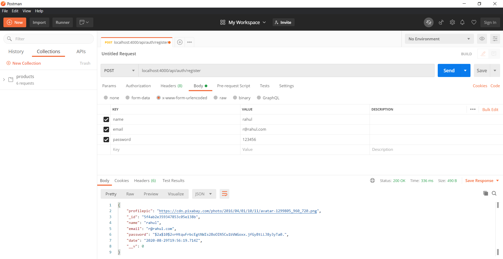
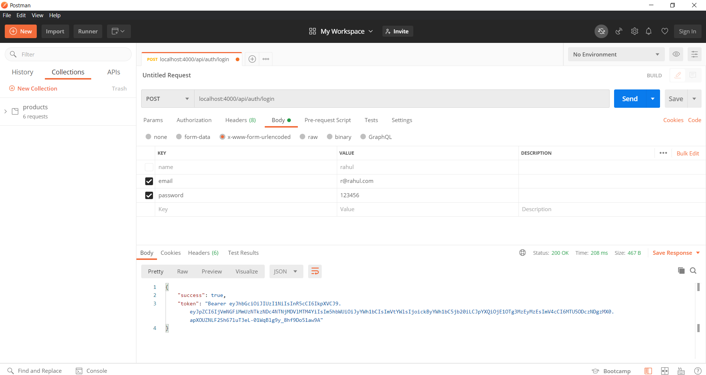
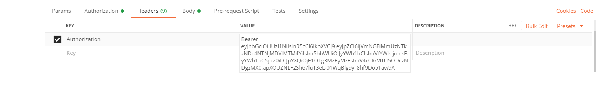
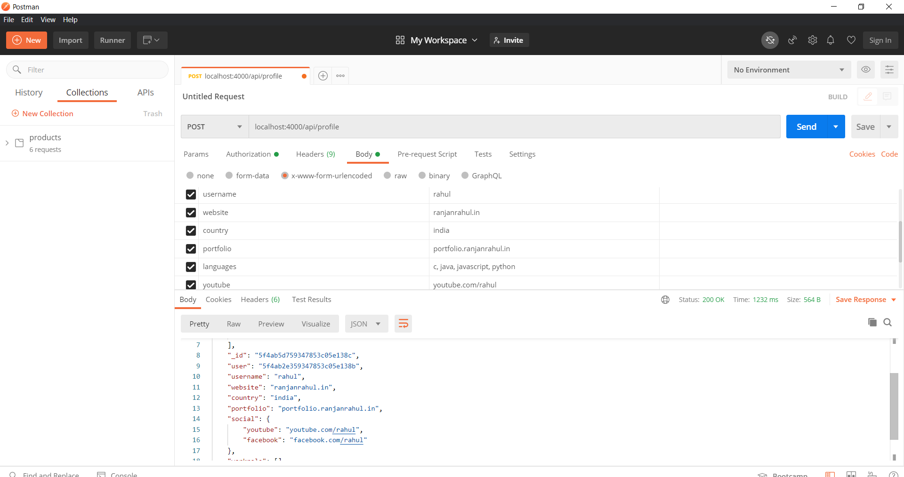
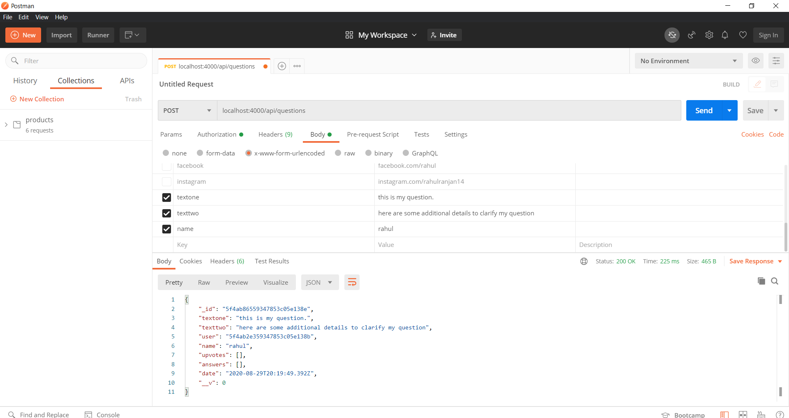
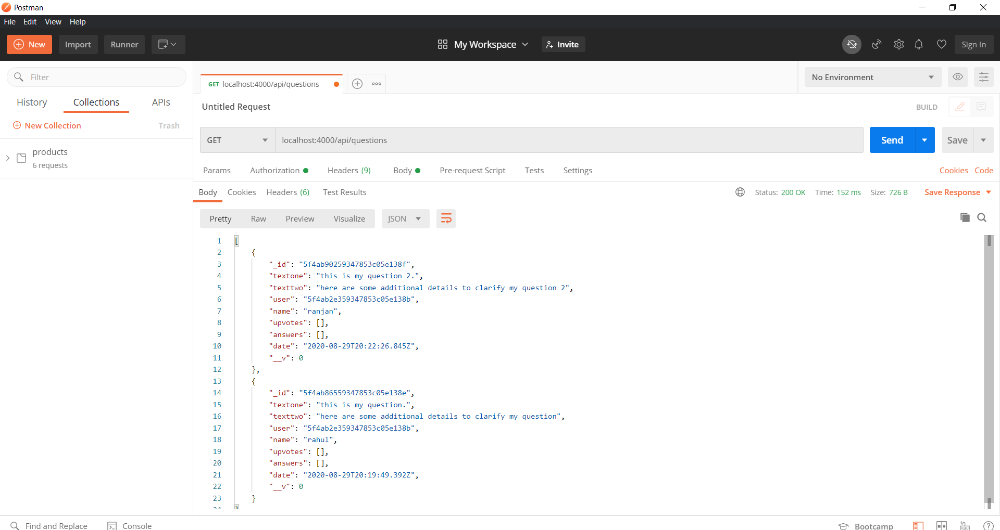
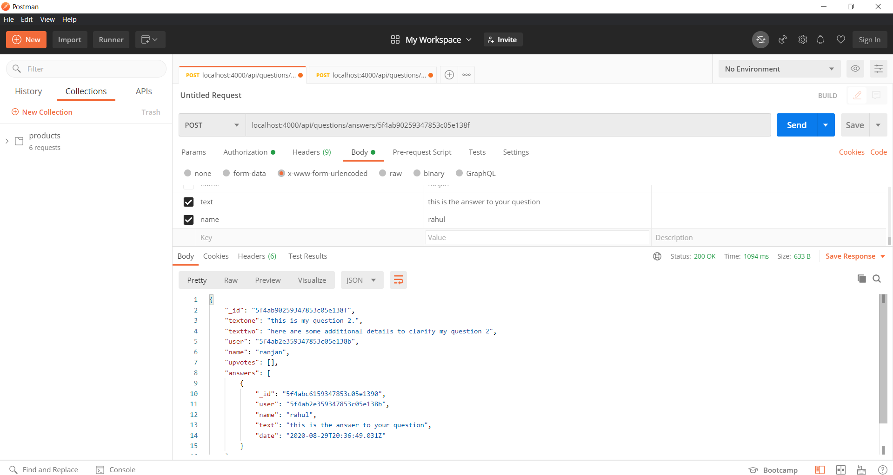

# stackOverflowAlikeBackend
A very basic version of stackoverflow alike website

# About
This is a backend of a website where a user can register, login, add his dev biodata,can add his other profile links, can ask questions, and other users can answer his questions.

# Technologies used
This backend is written in Node.js with the help of express framework. MongoDb is used for database, and for modelling the database mongoosejs is used. Bycript js is used for hashing
the password. Some other npm packages like body-parser, jsonwebtoken, passport, passport-jwt, validator is also used in this bakend.

# How to test
step 1: clone the repository  
step 2: run "npm install" in the root directory  
step 3: put your mongodb url inside the file "myurl.js"  
step 4: run "npm start"  
step 5: As this is not a full stack website so we need a tool like postman for testing purpose. So install that if you don't have.  
step 6: These screenshots may help in carrying out the testing process.  

# Register

# Login

copy the bearer token  

# Authorization
paste the bearer token here

# Profile

# Ask question

# Get all questions

# Answer

